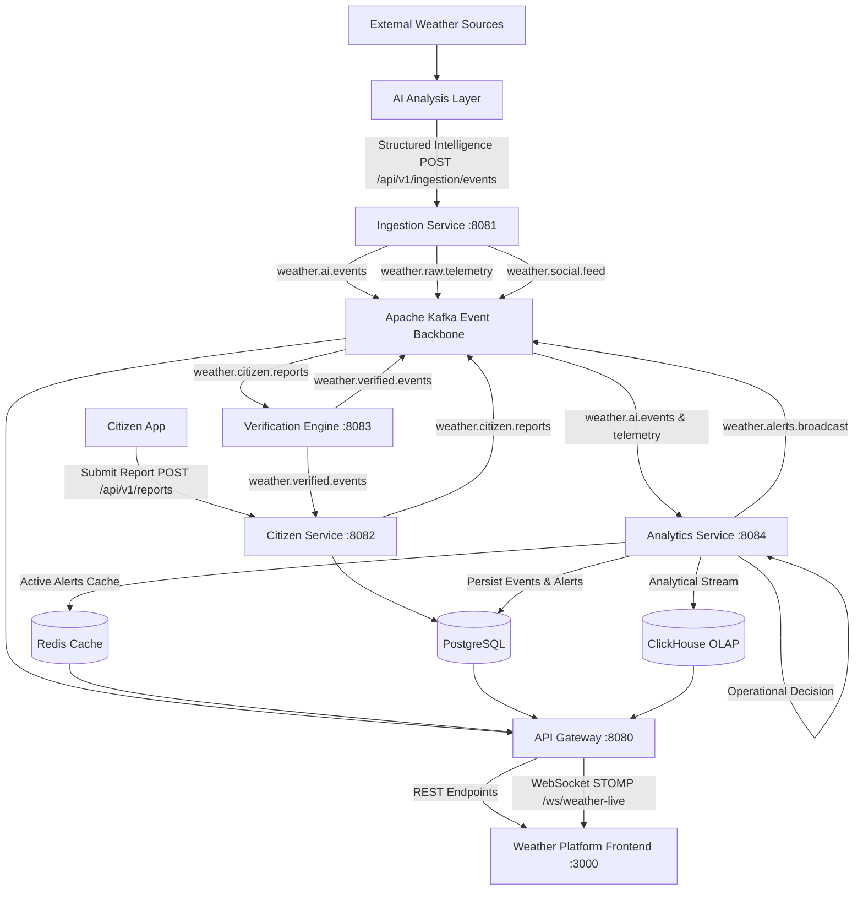

# National Weather Big Data Analytics Platform (SIH26069)
### Ministry of Earth Sciences (MoES) & India Meteorological Department (IMD) Operational Backend

An enterprise-grade, high-throughput meteorological big data and crowdsourced disaster verification platform built for **Smart India Hackathon 2026 (Problem Statement SIH26069)**.

---

## 🌟 Target Architecture & Boundaries



### Team Responsibility Boundary
- **AI Layer owns**: Searching across external sources, multi-source correlation, NLP classification, report deduplication, summarization, and generating versioned structured events.
- **Backend owns**: Validation, idempotency, event routing through Kafka, PostgreSQL relational storage, ClickHouse time-series OLAP, Redis caching, operational publishing decision, CAP 1.2 alert feed, API Gateway reverse proxy, and WebSocket STOMP broadcast.
- **Frontend owns**: Map displays, Verification console, Scenario lab triggers, and citizen reporting UI.

---

## 🛰️ Microservice Overview

| Service | Port | Primary Responsibilities |
|---|---|---|
| **`api-gateway`** | `8080` | Unified entry point, request proxy router, Spring STOMP WebSocket broker (`/ws/weather-live`), CORS |
| **`ingestion-service`** | `8081` | AI event ingestion (`POST /api/v1/ingestion/events`), schema validation, idempotency guard, Open-Meteo telemetry sync, scenario lab generator |
| **`citizen-service`** | `8082` | Citizen report submissions, PostgreSQL CRUD, upvotes, duplicate report prevention, status lifecycle |
| **`verification-engine`** | `8083` | Deterministic spatial-temporal sensor cross-matching (0–100 score), physical sensor contradiction checks, verified event publishing |
| **`analytics-service`** | `8084` | Operational publishing decision, ClickHouse OLAP time-series aggregations, PostgreSQL alert persistence, Redis active alert cache, CAP 1.2 XML feed |

---

## 📬 Kafka Topics

| Topic | Producer | Consumers | Purpose |
|---|---|---|---|
| `weather.ai.events` | `ingestion-service` | `analytics-service` | Clean, versioned AI structured events |
| `weather.raw.telemetry` | `ingestion-service` | `analytics-service`, `gateway` | High-frequency physical AWS sensor readings |
| `weather.social.feed` | `ingestion-service` | `verification-engine`, `gateway` | Real-time social signals and corroborated tweets |
| `weather.citizen.reports` | `citizen-service` | `verification-engine`, `gateway` | Crowdsourced citizen disaster submissions |
| `weather.verified.events` | `verification-engine` | `citizen-service`, `gateway` | Scored disaster verification results with reasoning |
| `weather.alerts.broadcast` | `analytics-service`, `verification-engine` | `gateway`, `analytics-service` | Operational active emergency alerts for real-time delivery |

---

## 🗄️ Database Architecture

### PostgreSQL (Relational Transactional Data)
- **`stations`**: Master catalog of 30+ AWS and Radar stations across India.
- **`citizen_reports`**: Citizen disaster submissions, coordinates, categories, verification status, and upvotes.
- **`verification_logs`**: Detailed factor-by-factor audit trail of every scoring calculation.
- **`ai_events`**: Persisted AI structured events with operational statuses (`ACTIVE_ALERT`, `MONITORING`, `DEBUNKED`).
- **`weather_alerts`**: CAP-compliant active emergency alerts with polygon geofence definitions and expiration times.

### ClickHouse (Columnar Time-Series OLAP)
- **`weather_db.raw_telemetry`**: Partitioned by month, ordered by state, district, station, timestamp. High-volume sensor ingest.
- **`weather_db.hourly_aggregates`**: SummingMergeTree for min/max/avg temperature, precipitation, pressure aggregations.
- **`weather_db.social_mentions`**: Disaster category social chatter trends.
- **`weather_db.ai_events_analytics`**: Long-term time-series analytics of AI intelligence events by category and severity.

### Redis (Low-Latency Cache)
- **`weather:alerts:active`**: Hash of currently active emergency alerts with 6-hour TTL.
- **`geo:stations`**: Geospatial station lookups.

---

## 📜 Contracts

### AI → Backend Contract
Endpoint: `POST /api/v1/ingestion/events` (alias: `POST /api/ingestion/events`)
```json
{
  "eventId": "event-001",
  "eventType": "FLOOD",
  "source": "AI_ANALYSIS",
  "location": {
    "city": "Mumbai",
    "state": "Maharashtra",
    "latitude": 19.0760,
    "longitude": 72.8777
  },
  "severity": "HIGH",
  "confidence": 94.0,
  "reportCount": 100,
  "summary": "Multiple sources indicate severe flooding.",
  "observedAt": "2026-09-02T10:30:00Z",
  "processedAt": "2026-09-02T10:30:05Z",
  "metadata": {
    "sourceList": ["twitter", "telegram", "news"]
  }
}
```

### Operational Publishing Decision Logic
1. **High-Confidence Extreme/High Event** (`confidence >= 75` and `severity >= HIGH`):
   - Example: Mumbai Cloudburst Flood (`confidence = 94%`, `severity = HIGH`)
   - Action: Operational status set to `ACTIVE_ALERT`.
   - Stored in PostgreSQL `ai_events` and `weather_alerts`.
   - Cached in Redis `weather:alerts:active`.
   - Published to Kafka `weather.alerts.broadcast`.
   - Pushed over WebSocket STOMP to `/topic/alerts`.
2. **Low-Confidence or Contradictory Event** (`confidence < 75` or refuted by sensors):
   - Example: Chennai Blizzard (`confidence = 12%`, `severity = LOW`)
   - Action: Operational status set to `DEBUNKED` or `MONITORING`.
   - Persisted in PostgreSQL `ai_events` and ClickHouse for historical analytics and audit.
   - **No public emergency alert** is broadcast.

### Backend → Frontend Delivery
- **REST Endpoints via Gateway (Port 8080)**:
  - `GET /api/v1/stations`: Active AWS stations
  - `GET /api/v1/reports`: Citizen reports (filterable by `status` and `state`)
  - `POST /api/v1/reports`: Submit citizen report
  - `POST /api/v1/reports/{id}/upvote`: Upvote report
  - `GET /api/v1/alerts/active`: Active weather alerts
  - `GET /api/v1/alerts/feed/cap`: Common Alerting Protocol 1.2 XML Feed
  - `GET /api/v1/analytics/timeseries`: Station time-series trend (ClickHouse)
  - `GET /api/v1/analytics/anomalies`: District-level meteorological anomalies
  - `GET /api/v1/analytics/events`: Ingested AI event summary
  - `GET /api/v1/analytics/system-stats`: Throughput, latency, and KPI metrics
- **WebSocket STOMP (`/ws/weather-live`) Topics**:
  - `/topic/alerts`: Active alert notifications
  - `/topic/verified`: Real-time report verification results
  - `/topic/reports`: New citizen report submissions
  - `/topic/telemetry`: Sampled telemetry events
  - `/topic/system-stats`: Health and throughput stats (every 2s)

---

## 🚀 How to Run the Platform

### Option A: Complete Docker Stack (Infra + All Microservices)

```bash
cd docker
docker compose --profile all up -d --build
```

### Option B: Docker Infrastructure + Local Microservices

1. **Start Infrastructure**:
   ```bash
   cd docker
   docker compose up -d
   ```
2. **Build and Test Backend**:
   ```bash
   cd weather-platform-backend
   mvn clean install
   ```
3. **Launch Microservices**:
   Run `.\run-all.ps1` from root, or start individual services:
   ```bash
   mvn spring-boot:run -pl ingestion-service     # Port 8081
   mvn spring-boot:run -pl citizen-service       # Port 8082
   mvn spring-boot:run -pl verification-engine   # Port 8083
   mvn spring-boot:run -pl analytics-service     # Port 8084
   mvn spring-boot:run -pl api-gateway           # Port 8080
   ```
4. **Validate Platform**:
   ```powershell
   .\validate-platform.ps1
   ```

---

## 🧪 Testing

Run all unit, integration, and operational decision pipeline tests:
```bash
cd weather-platform-backend
mvn test
```
Test coverage includes:
- `AiEventValidationTest`: Jakarta Bean Validation on lat/long, eventId, and confidence ranges.
- `AiEventIngestionServiceTest`: Ingestion, normalization, Kafka publishing, and idempotency deduplication.
- `CitizenReportServiceTest`: Submission, PostgreSQL persistence, upvoting, and duplicate detection.
- `VerificationEngineTest`: Ground truth spatial-sensor scoring (0-100), penalty matrix, and refutation.
- `AiEventConsumerServiceTest` & `EndToEndAiPipelineIntegrationTest`: Mumbai Flood vs. Chennai Blizzard operational decision pipelines.
- `GatewayRoutingControllerTest`: Gateway reverse proxy forwarding and graceful fallback.
